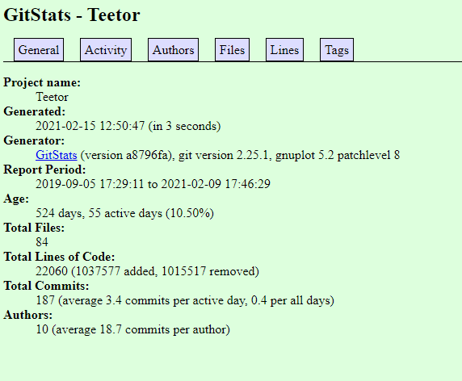
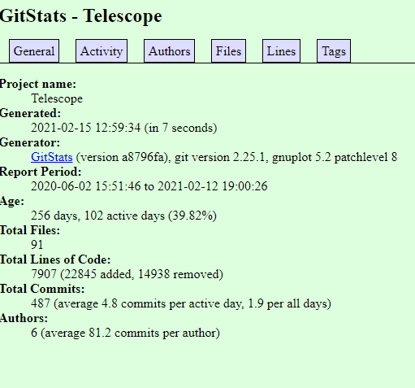
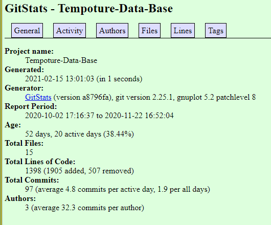
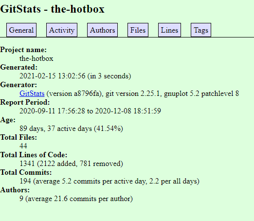
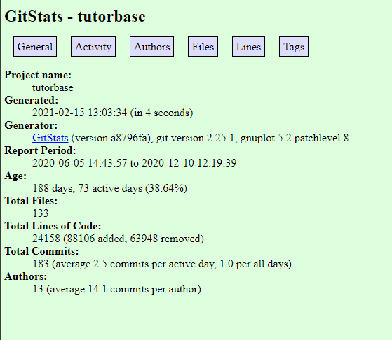

# Lab 01 Report - Introduction to Open Source Software
## Name: Covenant Faluyi (faluyc)
### email: faluyc@rpi,edu
### github account: TheCovenant
### discord handle: Kovenant (Kovenant#0067)

### Part 1 - Documentation
**Wiki page:**
https://github.com/TheCovenant/oss-repo-template/wiki/Project-Description

**Latex formulae:**
$\sqrt{1+2\sqrt{1+3\sqrt{1+4\sqrt{1+...}}}}$
$\sqrt{2}^{\sqrt{2}^{\sqrt{2}^{\sqrt{2}...}}}$

### Part 2 - Community
**Repo data**
1. Teetor
num. contributors: 5

num. lines of code: 29020

first commit: 
Author: aSehat <47791263+aSehat@users.noreply.github.com>
Date:   Thu Sep 5 17:29:11 2019 -0400

    Initial commit

latest commit: 
commit 8145c11444dfbeb668d693322c208574ed7a7d39 (HEAD -> UserCardMap, origin/master, origin/HEAD, master)
Merge: 3430a08 c820c0c
Author: roryeiffe <46585645+roryeiffe@users.noreply.github.com>
Date:   Tue Feb 9 17:46:29 2021 -0500

    Merge pull request #45 from aSehat/case

    Changed UserTypeSwitch to userTypeSwitch import in Sidebar.js

current branches:
 master
  remotes/origin/HEAD -> origin/master
  remotes/origin/MernFoundation
  remotes/origin/cleanup
  remotes/origin/dependabot/npm_and_yarn/Website/client/axios-0.21.1
  remotes/origin/dependabot/npm_and_yarn/backendWebsite/canvas/socket.io-2.4.0
  remotes/origin/dependabot/npm_and_yarn/outdatedMeanWebsite/ini-1.3.8
  remotes/origin/fixingWeirdFiles
  remotes/origin/frontEndSprintOne
  remotes/origin/fullstackTest
  remotes/origin/loginSignupUI

2. Telescope
num. contributors: 4

num. lines of code: 9894

first commit: 
commit e7efaecfcd37186002ca8d41962e8b28829c20bf
Author: Antonia Calia-Bogan <acaliabogan@acaliabogan.dev>
Date:   Tue Jun 2 15:51:46 2020 -0400

    Initial commit

latest commit: 
commit 3c05a6195f815413cce9ea545b6495b6e1a6fa0c (HEAD -> master, origin/master, origin/HEAD)
Author: Nia Calia-Bogan <acaliabogan@acaliabogan.dev>
Date:   Fri Feb 12 19:00:26 2021 -0500

    WIP API authentication

current branches:
 master

3. Tempoture
num. contributors: 2

num. lines of code: 1409

first commit: 
commit de4328f5678eb44db88cfe5a3c3de25934cb84de
Author: Jimmers2001 <38543433+Jimmers2001@users.noreply.github.com>
Date:   Fri Oct 2 17:16:37 2020 -0400

    Initial commit

latest commit: 
commit aa9c2481fbd98c303efd2b8f7caccd2ff113621a (HEAD -> main, origin/main, origin/HEAD)
Author: Jimmers2001 <38543433+Jimmers2001@users.noreply.github.com>
Date:   Sun Nov 22 16:52:04 2020 -0500

    Update README.md

    Update table of contents

current branches:
 main

4. The Hotbox
num. contributors: 9

num. lines of code: 11014

first commit: 
commit b2aa45276cc1e509e05027cfe22240dcdf65bd5f
Author: Bill Ni <bill.8ni@gmail.com>
Date:   Fri Sep 11 17:56:28 2020 -0400

    Initial commit

latest commit: 
commit 5ede3f578600ce2154f84a626eb1c2aec703616e (HEAD -> main, origin/main, origin/HEAD)
Merge: 2189372 ad244eb
Author: Bill Ni <bill.8ni@gmail.com>
Date:   Tue Dec 8 18:51:59 2020 -0500

    Merge pull request #88 from bnidevs/deployment

    update deployment branch for new docker container

current branches:
  remotes/origin/HEAD -> origin/main
  remotes/origin/backend
  remotes/origin/deployment
  remotes/origin/frontend
  remotes/origin/main
  remotes/origin/test_frontend
  remotes/origin/threading

5. Tutorbase
num. contributors: 12

num. lines of code: 31562

first commit: 
commit 3c3d08c884f763185e96d7b1e3fad02da67f5fdc
Author: Jason Nguyen <NguyenJason06@gmail.com>
Date:   Fri Jun 5 14:43:57 2020 -0400

    Initial commit

latest commit: 
commit 512674a05dac99f488f032d5a4e3830e784fdaab (HEAD -> master, origin/master, origin/HEAD)
Merge: e0648f1 3304166
Author: Jeremy Weiss <jweiss045@gmail.com>
Date:   Thu Dec 10 12:19:39 2020 -0500

    Merge branch 'tutor-operations'

current branches:
  remotes/origin/HEAD -> origin/master
  remotes/origin/client-meetings
  remotes/origin/data-analysis
  remotes/origin/jacob.zamani/redux_refactor/navigation
  remotes/origin/jacob.zamani/scheduler
  remotes/origin/master
  remotes/origin/nicholas.arnold/new_scheduler
  remotes/origin/nicholas.arnold/redux_refactor
  remotes/origin/schedule-meeting
  remotes/origin/thomas.arturi/login-redesign
  remotes/origin/thomas.arturi/react_schedule_selector

**git stats**'
1. Teetor

2. Telescope

3. Tempoture

4. The Hotbox

5. Tutorbase

**gource videos**
(exists as mp4 files in this directory)
1. Teetor

2. Telescope
3. Tempoture
4. The Hotbox
5. Tutorbase
