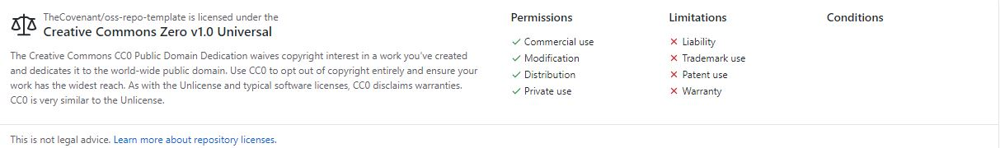

# Lab 4 Report - Open Source Licensing
### email: faluyc@rpi,edu
### github account: TheCovenant
### discord handle: Kovenant (Kovenant#0067)

1.

2. 

3. It is important to choose a license because it helps specify what can (and cannot) do with your source code. Without a license, then legally there can't be 'free' software anymore because of the legal risks involved. 
4. When a source code has no license, then it is under normal copyright. This means the original author would be well within right to sue you for using their work. To avoid such a scenario, it is best to be certain that there is proper licensing on a repository before using it. One should also make sure to read the license carefully to see what permissions it gives. \

5. I agree with this claim because opening up a developing project to a community helps to establish a solid base of users who become quite familiar with the project. Working on the project under closed doors tends to isolate the community from the project. Not only that, it makes potential contributors less familiar with the code and therefore makes it more difficult for them to make the modifications they want.

6. The GNU public license is intented to guarentee freedom to share/change software for all users. Anyone is allowed to view/modify/share software that is under the [GPL](https://www.gnu.org/licenses/old-licenses/gpl-2.0.en.html).  Linux started as a decision stemming from the creator's frustration with the licensing for the educational OS called MINIX, which was based on Unix. Annoyed by the license loop hopping needed to work with MINIX, he set out to create a free, open-source OS. Following this decision it is apparent why he used such a permissive license in the distributing of his work. (https://opensource.com/business/14/12/linux-philosophy#:~:text=Linux%20treats%20everyone%20equally%20and,should%20be%20allowed%20to%20do.)
7.  https://github.com/roryeiffe/Fresh-Results

8. 

Website | License Present | License
---------|:----------|:-------
OpenCircuits https://github.com/OpenCircuits/OpenCircuits | Yes | GPL http://www.gnu.org/licenses/
Anchor https://github.com/anchor-site/anchor | Yes | MIT License https://opensource.org/licenses/MIT
Venue https://github.com/rcos/Venue2 | Yes | MIT License https://opensource.org/licenses/MIT
Sage https://github.com/jamesac42/sage | Yes | MIT License https://opensource.org/licenses/MIT
Lavender https://github.com/kvverti/rusty-lavender | Yes | Mozilla Public License 2.0 https://www.mozilla.org/en-US/MPL/