# Lab 4 Report - Open Source Licensing
### email: faluyc@rpi,edu
### github account: TheCovenant
### discord handle: Kovenant (Kovenant#0067)


# Tutorial

## Step 1
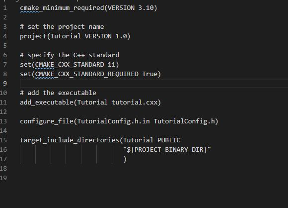
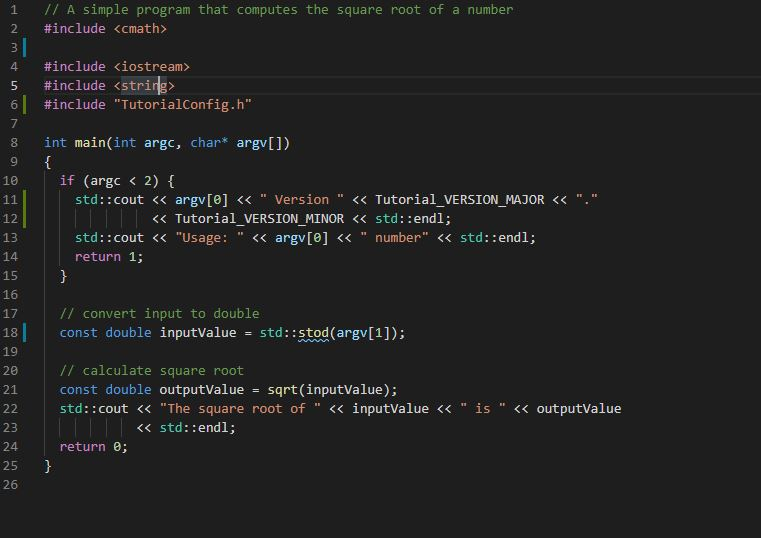


## Step 2
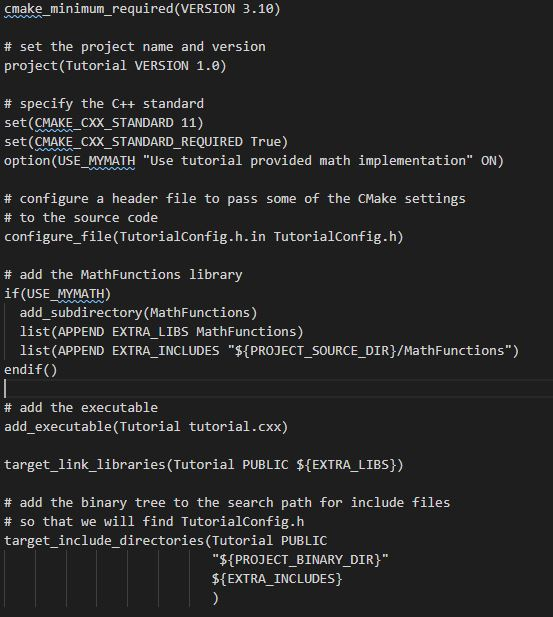
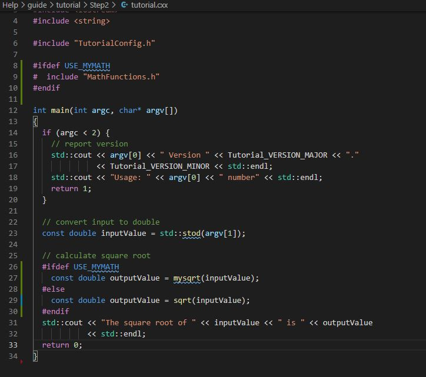
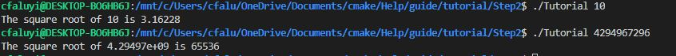

## Step 3
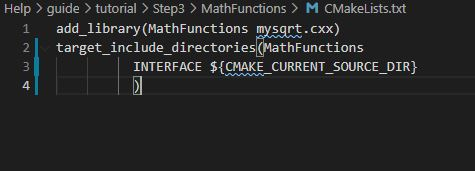
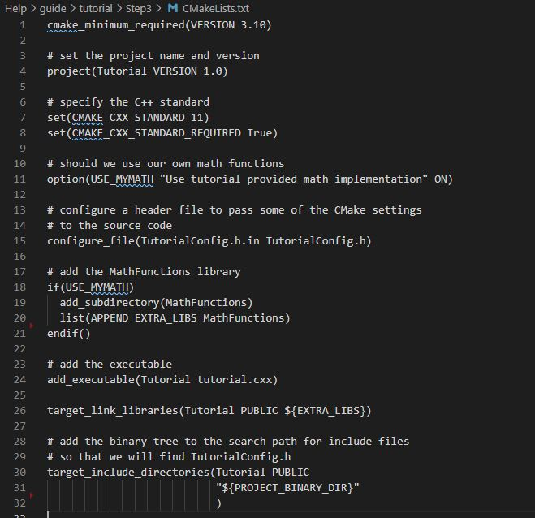
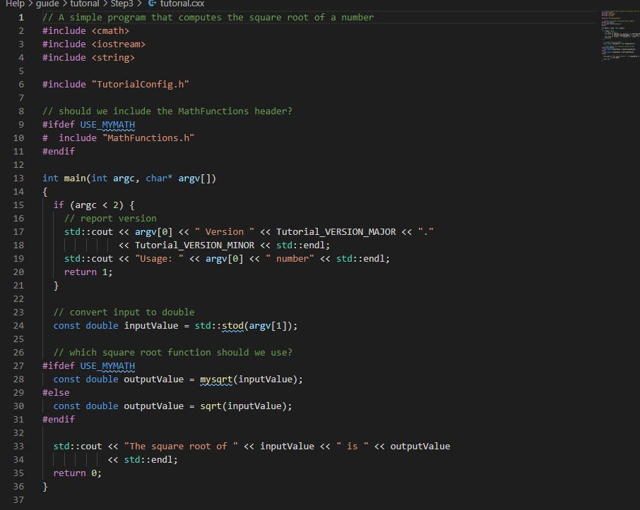
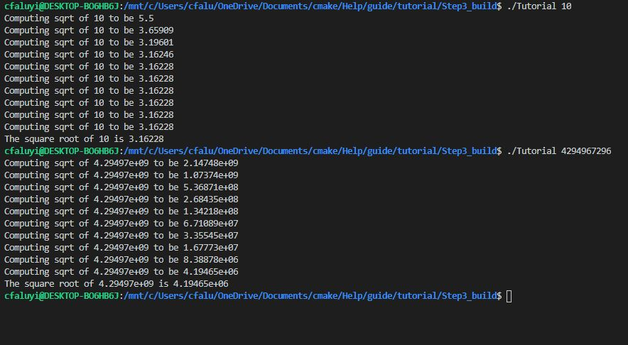


## Step 4 
### CMakeLists.txt
```

cmake_minimum_required(VERSION 3.10)

# set the project name and version
project(Tutorial VERSION 1.0)

# specify the C++ standard
set(CMAKE_CXX_STANDARD 11)
set(CMAKE_CXX_STANDARD_REQUIRED True)

# should we use our own math functions
option(USE_MYMATH "Use tutorial provided math implementation" ON)

# configure a header file to pass some of the CMake settings
# to the source code
configure_file(TutorialConfig.h.in TutorialConfig.h)

# add the MathFunctions library
if(USE_MYMATH)
  add_subdirectory(MathFunctions)
  list(APPEND EXTRA_LIBS MathFunctions)
endif()

# add the executable
add_executable(Tutorial tutorial.cxx)

target_link_libraries(Tutorial PUBLIC ${EXTRA_LIBS})

# add the binary tree to the search path for include files
# so that we will find TutorialConfig.h
target_include_directories(Tutorial PUBLIC
                           "${PROJECT_BINARY_DIR}"
                           )

install(TARGETS Tutorial DESTINATION bin)
install(FILES "${PROJECT_BINARY_DIR}/TutorialConfig.h"
  DESTINATION include
  )

enable_testing()

# does the application run
add_test(NAME Runs COMMAND Tutorial 25)

# does the usage message work?
add_test(NAME Usage COMMAND Tutorial)
set_tests_properties(Usage
  PROPERTIES PASS_REGULAR_EXPRESSION "Usage:.*number"
  )

# define a function to simplify adding tests
function(do_test target arg result)
  add_test(NAME Comp${arg} COMMAND ${target} ${arg})
  set_tests_properties(Comp${arg}
    PROPERTIES PASS_REGULAR_EXPRESSION ${result}
    )
endfunction(do_test)

# do a bunch of result based tests
do_test(Tutorial 4 "4 is 2")
do_test(Tutorial 9 "9 is 3")
do_test(Tutorial 5 "5 is 2.236")
do_test(Tutorial 7 "7 is 2.645")
do_test(Tutorial 25 "25 is 5")
do_test(Tutorial -25 "-25 is [-nan|nan|0]")
do_test(Tutorial 0.0001 "0.0001 is 0.01")

```

### MathFunctions/CMakeLists
```

add_library(MathFunctions mysqrt.cxx)

# state that anybody linking to us needs to include the current source dir
# to find MathFunctions.h, while we don't.
target_include_directories(MathFunctions
          INTERFACE ${CMAKE_CURRENT_SOURCE_DIR}
          )

install(TARGETS MathFunctions DESTINATION lib)
install(FILES MathFunctions.h DESTINATION include)

```

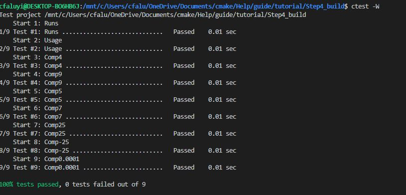


## Step 5
###CMakeLists
```
cmake_minimum_required(VERSION 3.10)

# set the project name and version
project(Tutorial VERSION 1.0)

# specify the C++ standard
set(CMAKE_CXX_STANDARD 11)
set(CMAKE_CXX_STANDARD_REQUIRED True)

# should we use our own math functions
option(USE_MYMATH "Use tutorial provided math implementation" ON)

# configure a header file to pass some of the CMake settings
# to the source code
configure_file(TutorialConfig.h.in TutorialConfig.h)

# add the MathFunctions library
if(USE_MYMATH)
  add_subdirectory(MathFunctions)
  list(APPEND EXTRA_LIBS MathFunctions)
endif()

# add the executable
add_executable(Tutorial tutorial.cxx)
target_link_libraries(Tutorial PUBLIC ${EXTRA_LIBS})

# add the binary tree to the search path for include files
# so that we will find TutorialConfig.h
target_include_directories(Tutorial PUBLIC
                           "${PROJECT_BINARY_DIR}"
                           )

# add the install targets
install(TARGETS Tutorial DESTINATION bin)
install(FILES "${PROJECT_BINARY_DIR}/TutorialConfig.h"
  DESTINATION include
  )

# enable testing
enable_testing()

# does the application run
add_test(NAME Runs COMMAND Tutorial 25)

# does the usage message work?
add_test(NAME Usage COMMAND Tutorial)
set_tests_properties(Usage
  PROPERTIES PASS_REGULAR_EXPRESSION "Usage:.*number"
  )

# define a function to simplify adding tests
function(do_test target arg result)
  add_test(NAME Comp${arg} COMMAND ${target} ${arg})
  set_tests_properties(Comp${arg}
    PROPERTIES PASS_REGULAR_EXPRESSION ${result}
    )
endfunction(do_test)

# do a bunch of result based tests
do_test(Tutorial 4 "4 is 2")
do_test(Tutorial 9 "9 is 3")
do_test(Tutorial 5 "5 is 2.236")
do_test(Tutorial 7 "7 is 2.645")
do_test(Tutorial 25 "25 is 5")
do_test(Tutorial -25 "-25 is [-nan|nan|0]")
do_test(Tutorial 0.0001 "0.0001 is 0.01")

```

#### MathFunctions/CMakeLists
```

add_library(MathFunctions mysqrt.cxx)

# state that anybody linking to us needs to include the current source dir
# to find MathFunctions.h, while we don't.
target_include_directories(MathFunctions
          INTERFACE ${CMAKE_CURRENT_SOURCE_DIR}
          )

# install rules
install(TARGETS MathFunctions DESTINATION lib)
install(FILES MathFunctions.h DESTINATION include)

include(CheckSymbolExists)
check_symbol_exists(log "math.h" HAVE_LOG)
check_symbol_exists(exp "math.h" HAVE_EXP)
if(NOT (HAVE_LOG AND HAVE_EXP))
  unset(HAVE_LOG CACHE)
  unset(HAVE_EXP CACHE)
  set(CMAKE_REQUIRED_LIBRARIES "m")
  check_symbol_exists(log "math.h" HAVE_LOG)
  check_symbol_exists(exp "math.h" HAVE_EXP)
  if(HAVE_LOG AND HAVE_EXP)
    target_link_libraries(MathFunctions PRIVATE m)
  endif()
endif()

if(HAVE_LOG AND HAVE_EXP)
  target_compile_definitions(MathFunctions
                             PRIVATE "HAVE_LOG" "HAVE_EXP")
endif()

```
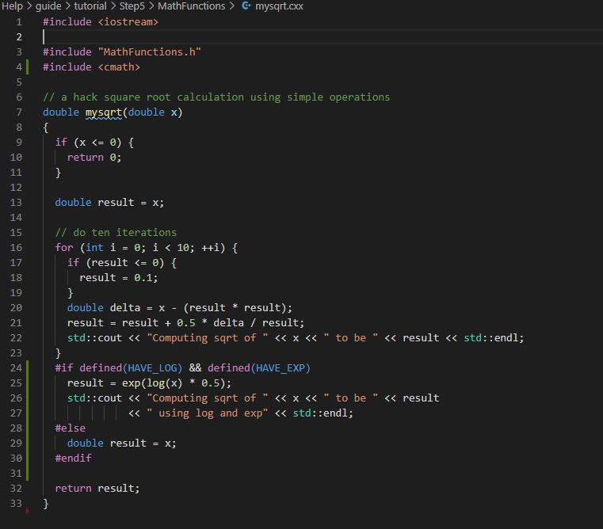
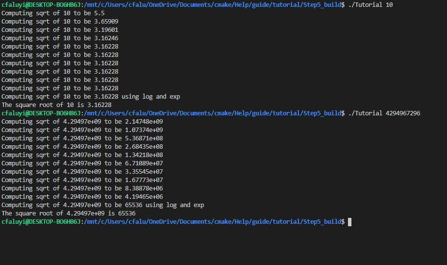