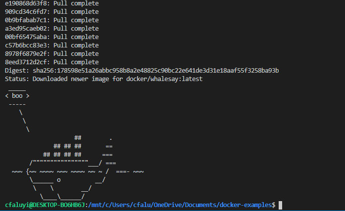
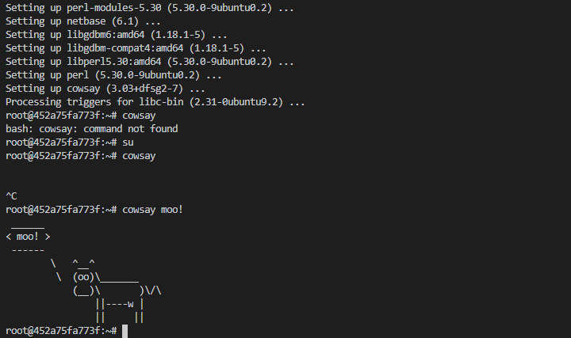
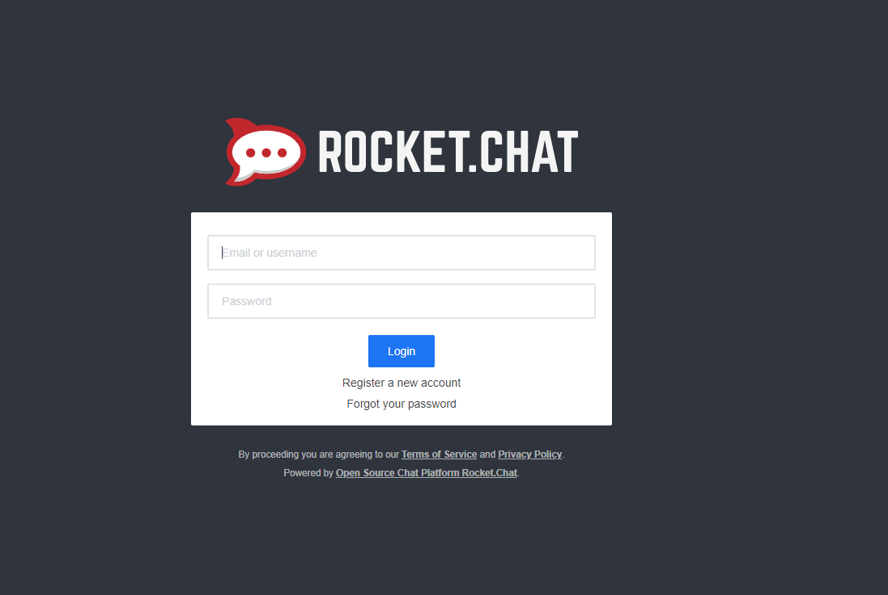
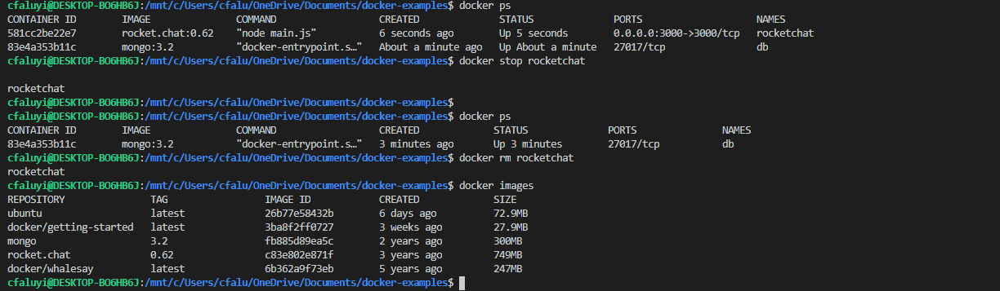
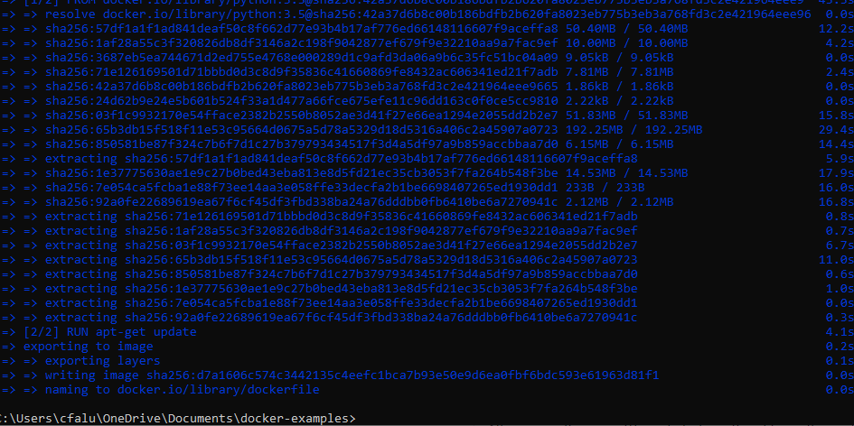

# Lab 8 - Open Source Licensing
### email: faluyc@rpi,edu
### github account: TheCovenant
### discord handle: Kovenant (Kovenant#0067)

## Example 00

### Proof of Docker Installation: 

## Example 01

### Vim:

### Cowsay:

## Example 02

### Rocket Chat:

### Some container commands:

## Example 3:

### Building the Docker Container:

###  browswer:

## Example 4:

