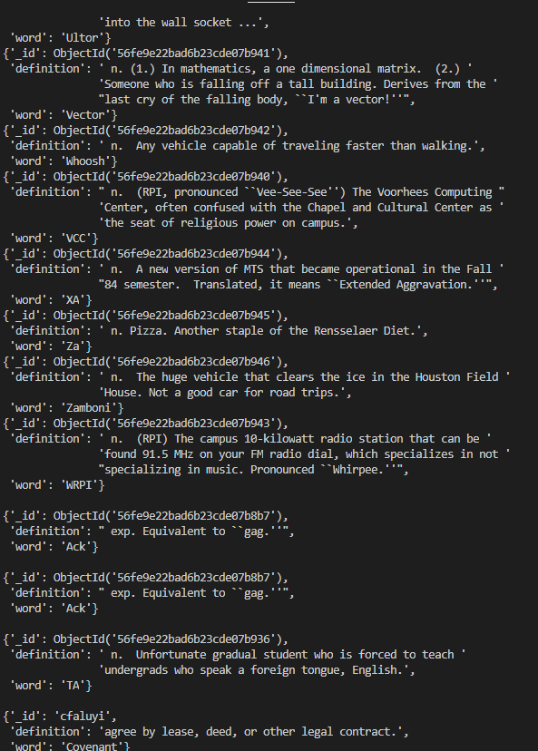

# Lab 9 
### email: faluyc@rpi,edu
### github account: TheCovenant
### discord handle: Kovenant (Kovenant#0067)


### 1. Running mangod and mango


## 2. Load some data


### 3. Basic Queries:


### 4. Driving Queries:
```
from pymongo import MongoClient
from bson.objectid import ObjectId
import pprint
client = MongoClient()

if __name__ == '__main__':
    client = MongoClient('localhost', 27017)
    db = client.mongo_db_lab
    #get collection
    collection = db.definitions

    #Printing all records
    for post in collection.find():
    	pprint.pprint(post)
    print()
   
    # Fetching one record
    pprint.pprint(collection.find_one())
    print()
    
    # Printing a specific record:
    pprint.pprint(collection.find_one({"word":"Ack"}))
    print()
    
    # Fetching by object id:
    pprint.pprint(collection.find_one({"_id":ObjectId("56fe9e22bad6b23cde07b936")}))
    print()
    
    # Inserting a new recprd :
    newWord = {"word":"Covenant",
    		"definition": "agree by lease, deed, or other legal contract.",
    		"_id":"cfaluyi"}
    newWordId= collection.insert_one(newWord).inserted_id
    # print out the word that we inserted:
    pprint.pprint(collection.find_one({"_id": newWordId}))
```


